# 序事 · Agentic 本地任务看板系统

> 基于 **Vue 3 (Composition API / `<script setup>`) + Vite + Tailwind CSS + localStorage** 纯前端实现，严格遵循 Agentic 驱动的多轮迭代与“计划-执行-确认”流程，零后端依赖。

- **GitHub 仓库**：[High-Logic/agentic-task-board](https://github.com/High-Logic/agentic-task-board)
- **交付内容**：完整源码、Node 单元测试、Playwright E2E 浏览器自动化测试、21 项全功能真实运行截图、提示词设计及开发日志。

---

## 目录
1. [功能需求与真实运行截图对照表](#一功能需求与真实运行截图对照表)
2. [核心功能运行截图矩阵](#二核心功能运行截图矩阵)
3. [Agentic 开发流程与提示词设计](#三agentic-开发流程与提示词设计)
4. [环境要求与运行命令](#四环境要求与运行命令)
5. [系统架构与持久化设计](#五系统架构与持久化设计)

---

## 一、功能需求与真实运行截图对照表

严格对齐课堂实践 PPT 要求的 6 大核心功能需求，均已通过自动化测试与浏览器验证：

| PPT 功能需求 | 验收标准与实现细节 | 对应运行截图 |
| :--- | :--- | :--- |
| **1. 任务增删改查** | 标题必填拦截（中文报错）、描述选填、详情完整弹窗查看、编辑原值回填、具名防误删确认弹窗。 | `02`, `03`, `04`, `05`, `06`, `07`, `08`, `09` |
| **2. 三种状态** | 待办 (`todo`)、进行中 (`in-progress`)、完成 (`done`) 三态全生命周期流转与统计联动。 | `01`, `11`, `12` |
| **3. 优先级三档** | 高（红 / Red）、中（黄 / Yellow）、低（绿 / Green），色彩标签与文字双重无障碍语义呈现。 | `01`, `10` |
| **4. 看板视图** | 三列卡片布局，基于 HTML5 原生拖拽（Drag & Drop）跨列即改状态，空列可投放，同列投放不触发无效更新。 | `11`, `12` |
| **5. 深色模式** | 一键切换深色/浅色主题，全站组件深度自适应，选择持久化记忆，刷新后保持主题。 | `13`, `14`, `18` |
| **6. 浏览器持久化** | 数据即时保存至 `localStorage`，刷新页面或重开标签页数据不丢失；具备异常损坏拦截保护机制。 | `15`, `16`, `21` |
| **7. 边缘与无障碍适配** | 独立空状态友好引导、移动端窄屏自适应、长文本截断与全量模态框阅读。 | `17`, `19`, `20` |

---

## 二、核心功能运行截图矩阵

> 所有截图均由 Playwright E2E 自动化测试流程真实捕获生成，对应文件保存在 `docs/screenshots/` 目录中。

### 1. 系统全貌与优先级展示（高红 / 中黄 / 低绿）

*图 1：浅色全貌 (`01-overview-light.png`) —— 包含 3 种状态分类统计与多种优先级任务*


*图 2：优先级三档同屏展示 (`10-priorities.png`) —— 高（红）、中（黄）、低（绿）色彩与文字并存*

---

### 2. 任务增删改查（标题必填、描述选填、回填编辑与具名删除）
| 创建与必填校验 | 描述选填与详情查看 |
| :---: | :---: |
| 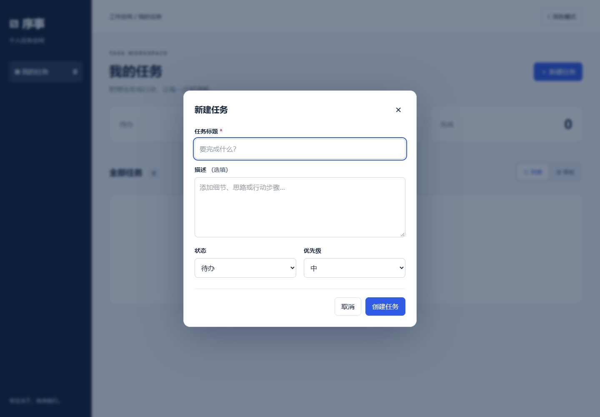<br/>*新建任务表单 (`02-create-form.png`)* | 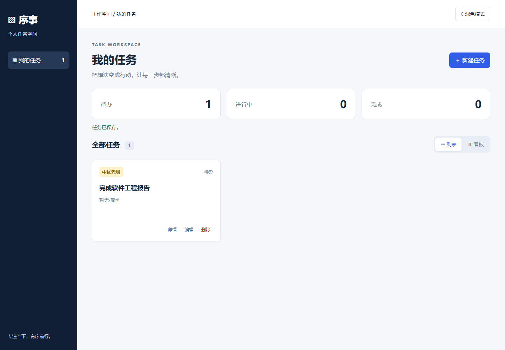<br/>*描述为空正常创建 (`04-created-without-description.png`)* |
| 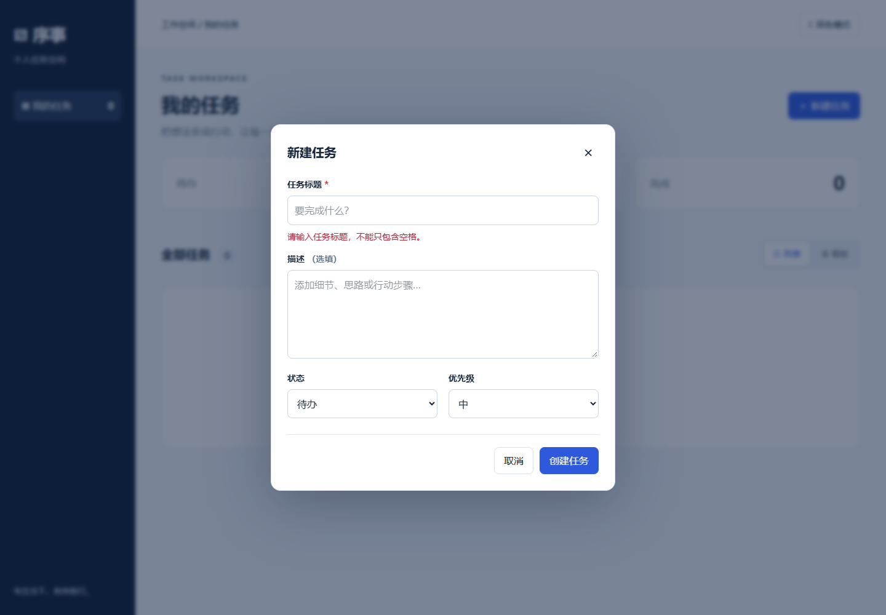<br/>*空标题拦截与中文错误提示 (`03-title-validation.png`)* | 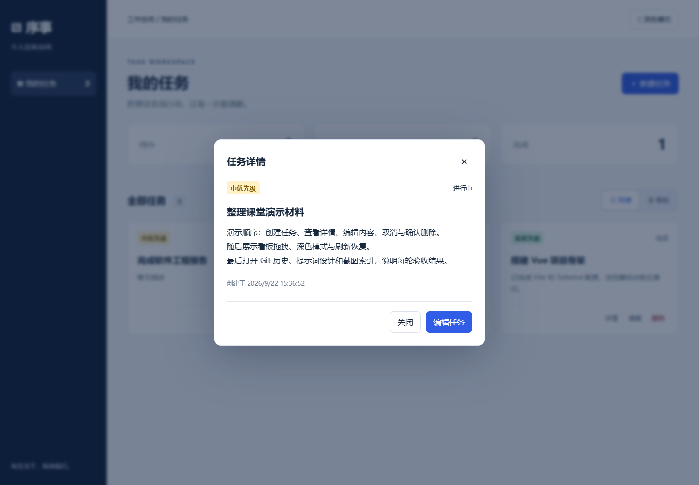<br/>*查看任务完整详情弹窗 (`05-task-details.png`)* |

| 编辑前后字段回填 | 具名删除确认防误删 |
| :---: | :---: |
| 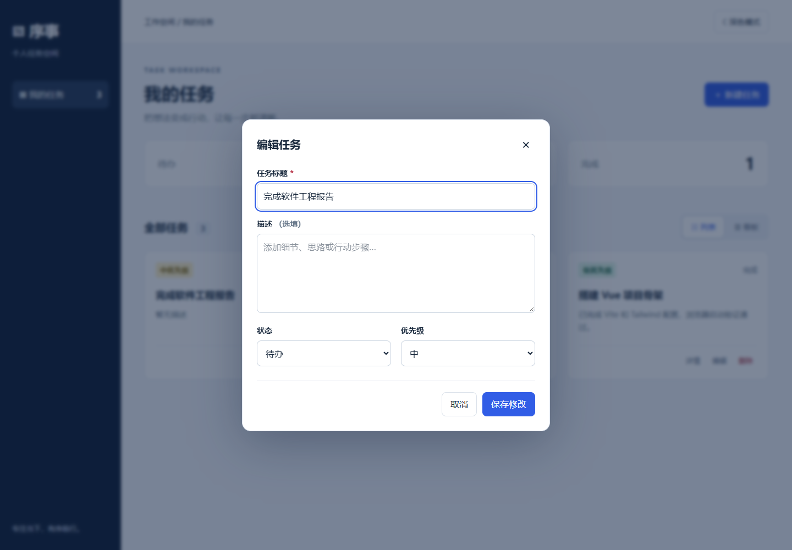<br/>*编辑回填原字段 (`06-edit-before.png`)* | 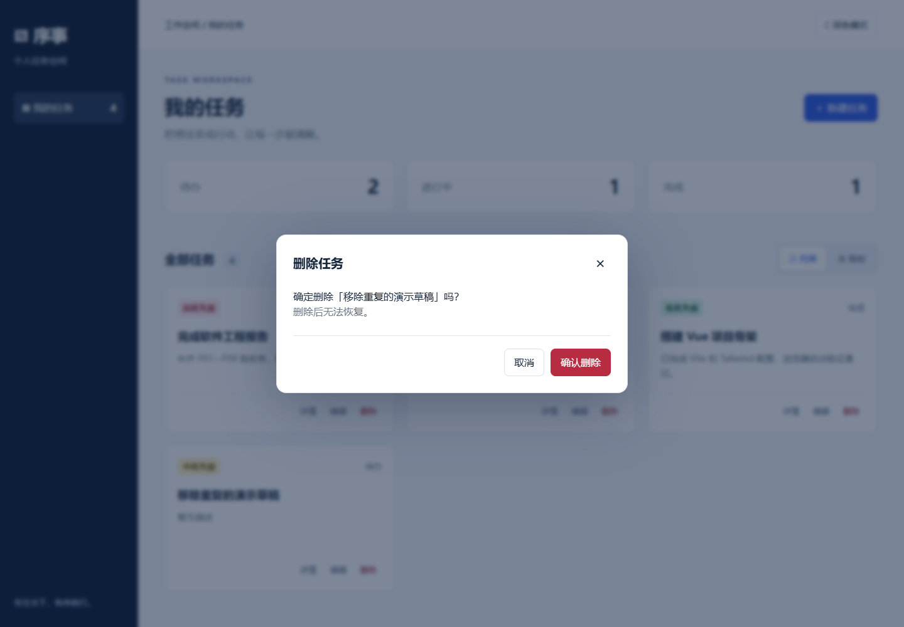<br/>*删除前具名确认提示 (`08-delete-confirm.png`)* |
| <br/>*编辑保存后字段与优先级更新 (`07-edit-after.png`)* | <br/>*确认删除后列表更新 (`09-delete-after.png`)* |

---

### 3. 三列看板视图与原生跨列拖拽（拖拽即改状态）
| 拖拽前：位于【待办】列 | 拖拽后：跨列移动至【进行中】列 |
| :---: | :---: |
| 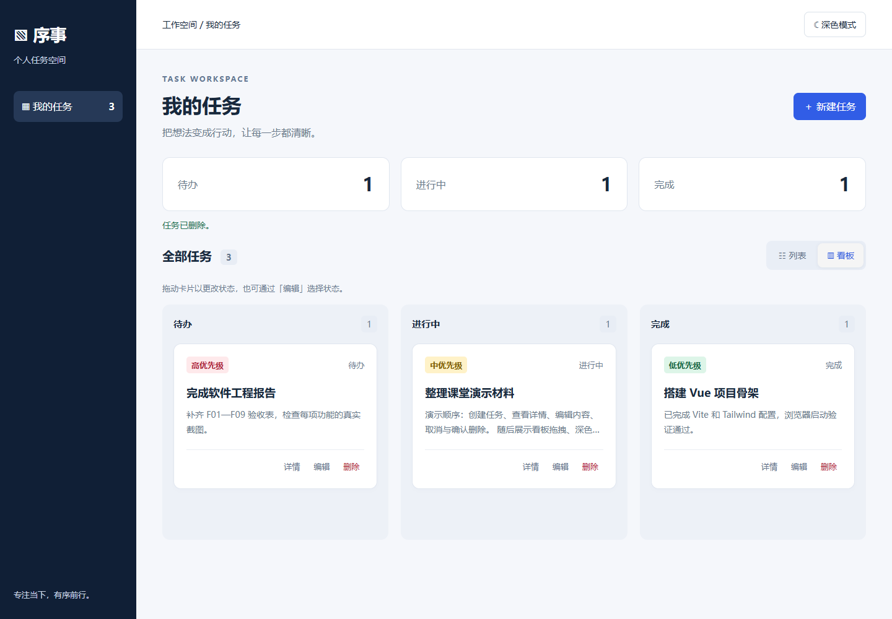<br/>*任务卡片位于待办列 (`11-board-before-drag.png`)* | 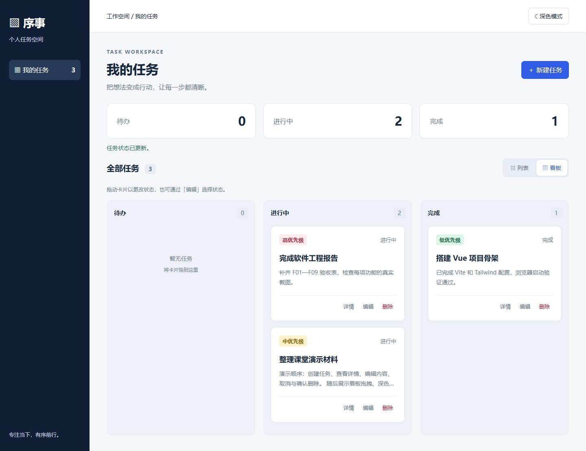<br/>*原生拖拽释放后状态瞬间持久化更新 (`12-board-after-drag.png`)* |

---

### 4. 深色模式（一键切换、刷新记忆、表单适配）
| 深色模式看板 | 刷新后主题记忆恢复 | 深色模式表单交互 |
| :---: | :---: | :---: |
| <br/>*深色模式视图 (`13-dark-mode.png`)* | 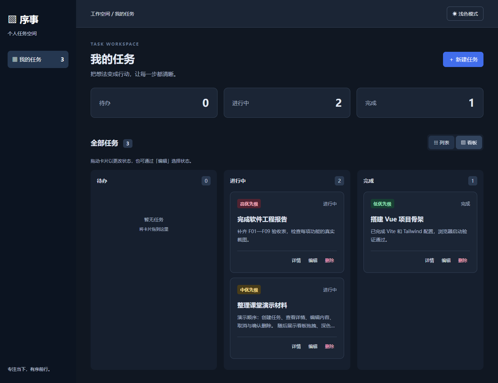<br/>*刷新后深色状态依然保留 (`14-theme-after-reload.png`)* | 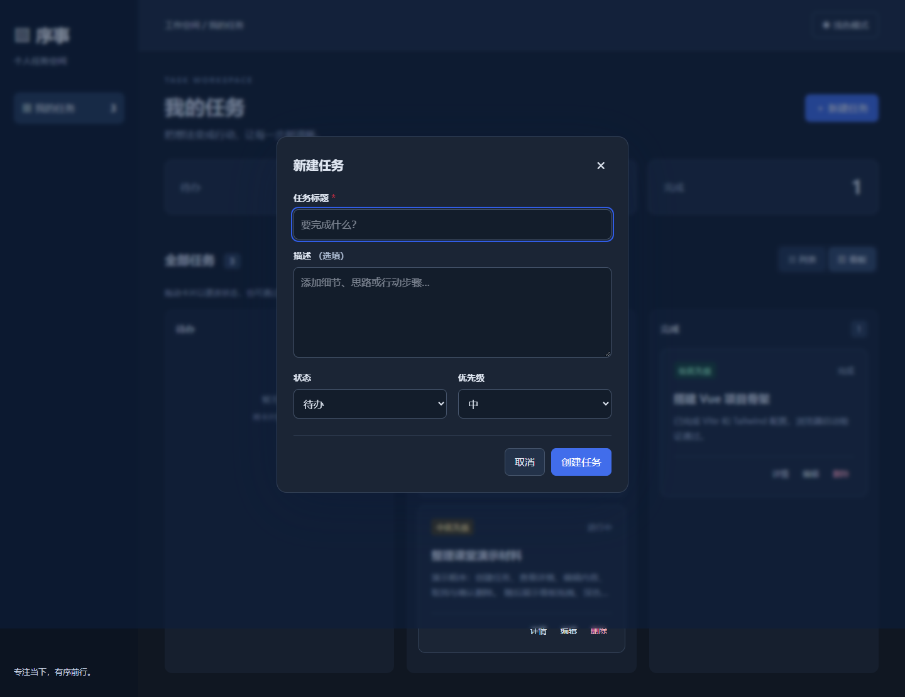<br/>*深色模式模态框 (`18-dark-form.png`)* |

---

### 5. 浏览器持久化与健壮性容错（刷新不丢失、防覆盖）
| 刷新前数据状态 | 刷新后数据完整恢复 | 存储损坏拦截保护 |
| :---: | :---: | :---: |
| <br/>*保存3项任务 (`15-data-before-reload.png`)* | 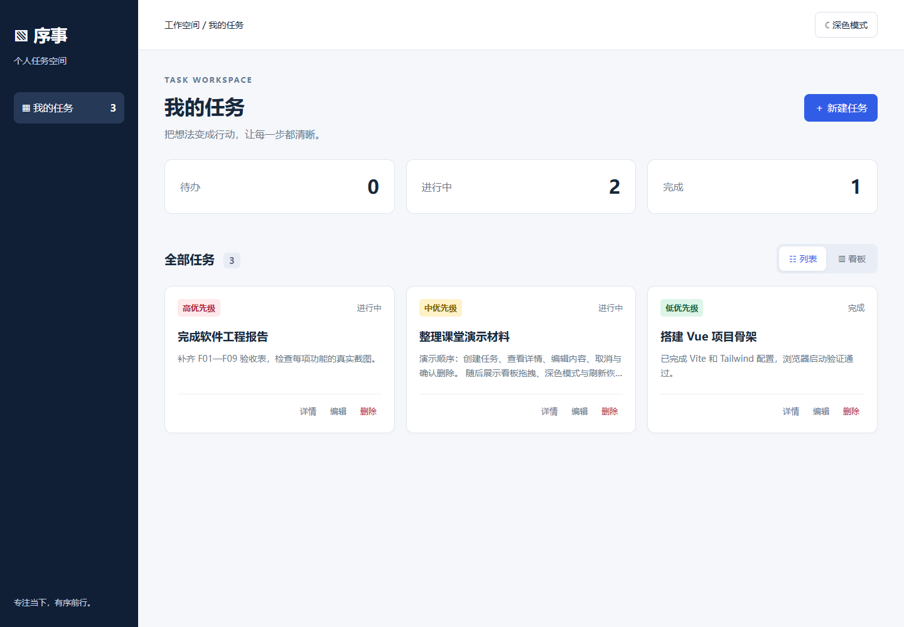<br/>*刷新后内容与状态一致 (`16-data-after-reload.png`)* | 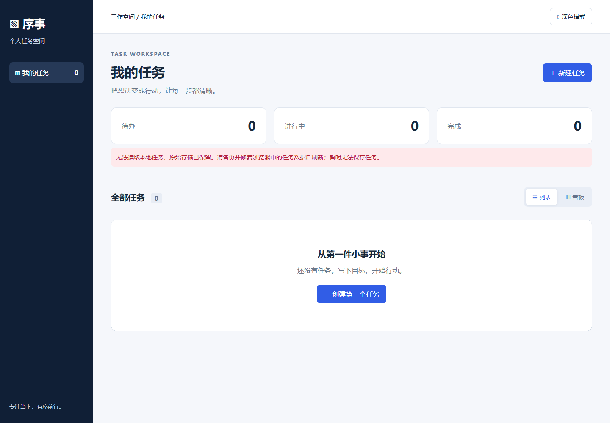<br/>*损坏数据保留且友好提示 (`21-storage-error.png`)* |

---

### 6. 响应式与边缘场景
| 友好空状态 | 移动端适配 (390px) | 长文本无溢出与详情滚动 |
| :---: | :---: | :---: |
| 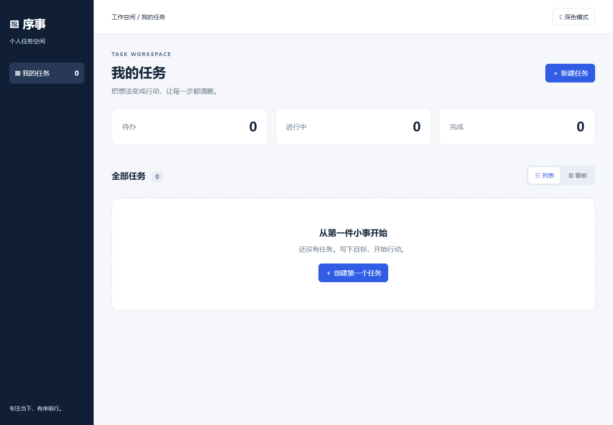<br/>*无任务时的引导 (`17-empty-state.png`)* | 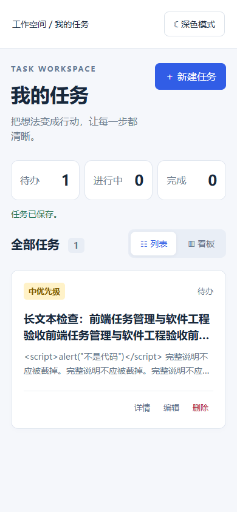<br/>*移动端布局自适应 (`19-mobile-list.png`)* | 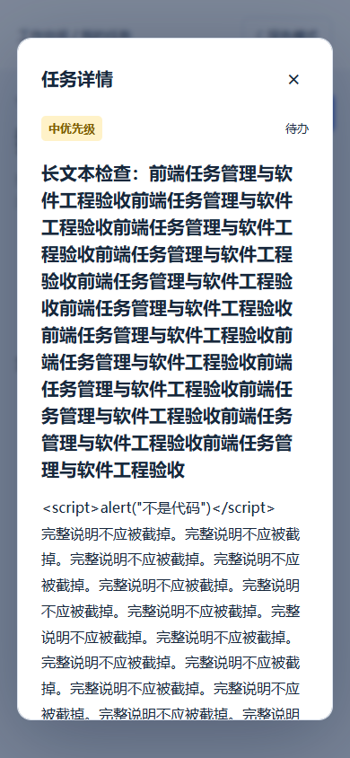<br/>*长文本弹窗安全滚动 (`20-long-text.png`)* |

> 21 张真实截图说明文档见：[docs/screenshots/README.md](docs/screenshots/README.md)

---

## 三、Agentic 开发流程与提示词设计

开发过程严格践行课堂实践 PPT 规定的 **“计划 (Plan) → 执行 (Act) → 确认 (Verify) → 提交 (Commit)”** 闭环，通过分步骤的多轮 Prompt 引导 AI 智能体协同完成：

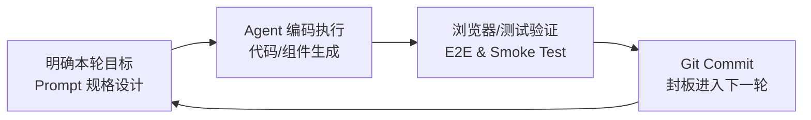

### 1. 核心系统提示词（System Prompt）
```text
你是一名严谨的高级前端架构师。我们将基于 Vue 3 (<script setup>) + Vite + Tailwind CSS 构建纯前端本地任务管理应用。
必须严格遵循以下工程约束：
1. 架构原则：严禁引入后端服务或第三方臃肿状态库，基于 Composition API 和单一响应式数组派生视图。
2. 数据安全：持久化采用“先写存储、成功后再替换内存”的事务模式；遇到 JSON 损坏需提示并保留现场，严禁静默覆盖。
3. 规范交互：优先级必须同时呈现红/黄/绿视觉色彩和中文文本；看板使用原生 HTML5 Drag & Drop，同列释放不触发冗余操作。
4. 无障碍与健壮性：模态框使用原生 <dialog> 并具备焦点管理；文本采用普通插值，杜绝 XSS 风险。
```

### 2. 多轮迭代开发过程（Round 1 - Round 5）

- **Round 1：项目骨架与核心数据模型（对应 PPT：确认项目骨架）**
  - **提示词设计**：“使用 Vite 初始化 Vue 3 项目，配置 Tailwind CSS。在 `src/model.js` 中定义任务模型：`{ id, title, description, status, priority, createdAt, updatedAt }`。建立三种状态枚举与高（红）、中（黄）、低（绿）优先级常量，提供合法性校验函数。”
  - **验证与 Commit**：验证 Node 导入与类型定义正常，完成初始骨架提交。
- **Round 2：核心功能与任务列表清单（对应 PPT：开发核心功能）**
  - **提示词设计**：“编写 `useTasks.js`、`TaskForm.vue` 和 `TaskCard.vue`。实现新增任务（标题必填、描述选填）、详情弹窗、编辑回填和具名删除模态框。在列表卡片上明确体现红黄绿三色优先级标签。”
  - **验证与 Commit**：浏览器手动测试增删改查流转无误，提交代码。
- **Round 3：数据持久化与容错防御（对应 PPT：数据持久化）**
  - **提示词设计**：“在 `src/storage.js` 实现键名为 `xushi.tasks.v1` 的读写逻辑。编写安全的 JSON 解析和数组结构验证函数；若 localStorage 数据被外部篡改或损坏，给出友好的 UI 警告，并阻止覆写原损坏内容。”
  - **验证与 Commit**：注入非法 JSON 字符串验证容错拦截，提交持久化模块。
- **Round 4：看板视图与前端拖拽交互（对应 PPT：开发看板视图及交互）**
  - **提示词设计**：“开发 `TaskBoard.vue` 三列看板视图（待办 / 进行中 / 完成）。使用原生 HTML5 拖拽 API 实现卡片跨列拖动即更新任务状态，支持空列释放，并在移动端或键盘环境下保留编辑状态备用入口。”
  - **验证与 Commit**：在 Chrome 中验证鼠标拖拽跨列流转，提交看板交互模块。
- **Round 5：深色模式与全功能端到端自动化测试封板**
  - **提示词设计**：“实现 `useTheme.js` 管理 `dark`/`light` 模式并在 `xushi.theme.v1` 中持久化。编写自动化测试套件（5 项单元测试 + 8 项 Playwright 浏览器 E2E 测试），并截取 21 张真实运行图形成验收文档。”
  - **验证与 Commit**：`npm test` 与 `npm run test:e2e` 全部通过，输出测试报告。

> 完整提示词与多轮交互日志见：[docs/prompt-design.md](docs/prompt-design.md) 与 [docs/development-log.md](docs/development-log.md)。

---

## 四、环境要求与运行命令

- **开发推荐环境**：Node.js >= 20.x 或 24 LTS，npm >= 10.x
- **技术栈依赖版本**：Vue 3.5.43、Vite 7.3.6、Tailwind CSS 4.3.3、Playwright 1.63.0

```bash
# 1. 安装项目依赖
npm ci

# 2. 启动本地开发服务
npm run dev
# 浏览器打开：http://127.0.0.1:5173

# 3. 运行 Node 核心单元测试（5 项通过）
npm test

# 4. 运行 Playwright 浏览器端到端自动化测试（8 项通过）
npm run test:e2e

# 5. 构建生产包与本地预览
npm run build
npm run preview
# 浏览器打开：http://127.0.0.1:4173
```

> **测试日志**：全部测试运行结果已归档至 [docs/test-results/](docs/test-results/)。

---

## 五、系统架构与持久化设计

### 1. 源码架构
```text
src/
├── App.vue          # 主页面：布局协调、顶栏切换、全局模态框宿主
├── TaskForm.vue     # 新建/编辑任务表单（必填/选填校验、焦点锁定）
├── TaskCard.vue     # 任务卡片（红黄绿优先级角标、操作菜单）
├── TaskBoard.vue    # 三列看板视图（原生 HTML5 跨列拖拽）
├── Modal.vue        # 原生 <dialog> 封装（无障碍焦点管理）
├── model.js         # 数据规范、状态与优先级常量、校验工具函数
├── useTasks.js      # 响应式状态管理，保证单一数据源与事务持久化
├── storage.js       # localStorage 读写、数据校验与容错防御
├── useTheme.js      # 深浅主题切换及持久化管理
└── style.css        # Tailwind 入口与基础组件样式
```

### 2. 本地存储规范
| 存储键名 | 数据格式 | 说明 |
| :--- | :--- | :--- |
| `xushi.tasks.v1` | `Array<Task>` (JSON) | 任务实体持久化列表，包含创建与修改时间戳 |
| `xushi.theme.v1` | `string` (`light` \| `dark`) | 用户主题偏好，默认浅色 |

