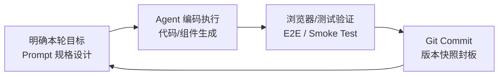

# 序事 · Agentic 本地任务看板系统

> **北京大学 软件工程课程 · Agentic 开发实践作业**  
> 基于 **Vue 3 (Composition API / `<script setup>`) + Vite + Tailwind CSS + localStorage** 纯前端实现，严格遵循 Agentic
> 驱动的多轮迭代与“计划-执行-确认”流程。

- **GitHub 仓库**：[High-Logic/agentic-task-board](https://github.com/High-Logic/agentic-task-board)
- **部署/运行特性**：纯前端无后台依赖、支持原生跨列拖拽、深浅色一键切换持久化、数据断电/刷新不丢失。

---

## 目录

1. [功能需求验收与运行截图](#一功能需求验收与运行截图)
2. [Agentic 开发流程与提示词设计](#二agentic-开发流程与提示词设计)
3. [快速开始与环境要求](#三快速开始与环境要求)
4. [系统架构与持久化设计](#四系统架构与持久化设计)
5. [5-10 分钟课堂演示提纲](#五5-10-分钟课堂演示提纲)

---

## 一、功能需求验收与运行截图

本项目已完整实现课程实践要求的全部 6 项核心功能，并通过 Playwright 端到端（E2E）测试与单元测试覆盖验证：

| 需求编号     | PPT 对应需求项   | 实现说明                                                       | 对应截图         |
|:---------|:------------|:-----------------------------------------------------------|:-------------|
| **F-01** | **任务增删改查**  | 标题必填、描述选填；支持完整详情查看、表单数据回填编辑与具名防误删确认弹窗。                     | 见图 1、图 2、图 3 |
| **F-02** | **三种任务状态**  | 严格支持【待办 (`todo`)】、【进行中 (`in-progress`)】、【完成 (`done`)】三态流转。 | 见图 1、图 4     |
| **F-03** | **优先级三档**   | 【高】红标 (Red)、【中】黄标 (Yellow)、【低】绿标 (Green)，色彩与文字双重语义呈现。      | 见图 1、图 2     |
| **F-04** | **三列看板与拖拽** | HTML5 原生拖拽（Drag & Drop），跨列释放即改状态，支持空列释放，提供移动端/键盘辅助兼容。      | 见图 4、图 5     |
| **F-05** | **深色模式**    | 一键无缝切换 Dark/Light Mode，CSS 变量自适应，选择持久化记忆。                  | 见图 5         |
| **F-06** | **浏览器持久化**  | 数据即时落盘 `localStorage`，页面刷新/重开数据不丢失；具备异常损坏拦截保护机制。           | 见图 6         |

### 核心功能运行截图

#### 1. 系统全貌与任务列表（增删改查、三种状态、红黄绿优先级）


*图 1：主界面全貌——清晰呈现待办/进行中/完成三态统计，以及高（红）、中（黄）、低（绿）优先级标签*

#### 2. 任务创建与详情编辑（标题必填、描述选填、表单回填）


*图 2：新建/编辑任务模态框——支持必填字段校验、优先级选择、原生焦距管理*

#### 3. 具名删除确认（防误删模态框）


*图 3：原生 dialog 实现的具名删除弹窗，提升数据安全性*

#### 4. 三列看板视图与原生跨列拖拽


*图 4：看板视图——任务卡片可任意拖拽至目标列（待办/进行中/完成），松手即刻持久化更新状态*

#### 5. 深色模式一键切换与状态记忆


*图 5：一键深色模式——夜间调色契合 Tailwind 规范，自动持久化至本地存储，刷新依然生效*

#### 6. 浏览器数据持久化（刷新不丢失验证）


*图 6：刷新浏览器前后数据保持一致，LocalStorage 写入事务安全机制生效*

> 完整 21 张运行测试过程截图请参阅：[截图完整索引文档](docs/screenshots/README.md)

---

## 二、Agentic 开发流程与提示词设计

本项目严格遵循课程要求的 **“计划 (Plan) → 执行 (Act) → 确认 (Verify) → 提交 (Commit)”** 循环，共历经 5 轮 Agentic 协作迭代完成：



### 1. 核心系统提示词（System Prompt）架构

在对话初期，为 Agent 确立了严格的角色职责与边界规范，避免模型产生幻觉或引入多余后端依赖：

```text
你是一名严谨的高级前端架构师。我们将基于 Vue 3 (<script setup>) + Vite + Tailwind CSS 构建纯前端本地任务看板应用。
必须严格遵循以下工程公约：
1. 架构原则：严禁引入服务端接口，所有数据操作必须直接面向 localStorage，保证单一数据源响应式派生。
2. 健壮性：持久化采用“先写存储、再更内存”的事务模式；遇到 JSON 损坏需报警并保护原有数据，严禁静默覆盖。
3. 可访问性与语义化：高/中/低优先级必须同时具备红/黄/绿视觉色彩和中文文字描述；弹窗必须具备焦点管理与 ESC 关闭机制。
4. 交互标准：看板跨列拖拽使用 HTML5 原生 Drag & Drop API，空列必须支持投放，同列投放不触发冗余更新。
```

### 2. 多轮迭代提示词设计（Prompt Iterations）

- **Round 1：工程骨架与状态模型搭建**
    - **Prompt 要点**：“使用 Vite 初始化 Vue 3 项目，配置 Tailwind CSS。在 `src/model.js` 中定义任务核心数据结构（包含 id,
      title, description, status, priority, createdAt, updatedAt），设定三种状态与三档优先级常量，提供合法性校验与默认工厂函数。”
- **Round 2：核心任务增删改查与列表视图**
    - **Prompt 要点**：“基于 Composition API 实现 `useTasks.js`。编写 `TaskCard.vue` 与 `TaskForm.vue`
      ，满足标题必填、描述选填，实现新增、编辑表单回填、具名删除确认。要求高（红）、中（黄）、低（绿）标签在界面清晰展示。”
- **Round 3：数据持久化与容错保护**
    - **Prompt 要点**：“在 `storage.js` 中实现键为 `xushi.tasks.v1` 的持久化逻辑。编写健壮的 JSON 解析器，针对数据损坏、存储超额做
      try-catch 拦截并抛出用户友好提示，严禁损坏时清空覆盖。”
- **Round 4：三列看板与跨列拖拽实现**
    - **Prompt 要点**：“编写 `TaskBoard.vue`，实现‘待办、进行中、完成’三列看板。使用原生 HTML5 拖拽
      API，使卡片被拖动放入不同列时自动更新状态并持久化。为手机端和键盘用户保留备用的状态变更操作入口。”
- **Round 5：深色模式切换与全功能 E2E 验证**
    - **Prompt 要点**：“实现 `useTheme.js` 统一管理 `light`/`dark` 主题类名，切换后存入 `xushi.theme.v1`
      。编写自动化测试脚本（单元测试 + Playwright 端到端测试），对增删改查、拖拽流转、深色模式与刷新持久化进行全覆盖运行。”

> 完整多轮 Prompt 及原始工程对话记录请见：[docs/prompt-design.md](docs/prompt-design.md)
> 与 [docs/development-log.md](docs/development-log.md)。

---

## 三、快速开始与环境要求

- **推荐运行环境**：Node.js >= 20.x 或 24 LTS，npm >= 10.x
- **核心技术栈**：Vue 3.5、Vite 7.3、Tailwind CSS 4.3、Playwright 1.63

### 运行步骤

```bash
# 1. 安装依赖
npm ci

# 2. 启动本地开发服务器
npm run dev
# 浏览器访问：http://127.0.0.1:5173

# 3. 运行单元测试
npm test

# 4. 运行全流程端到端自动化测试（启动 Chrome 验证所有交互）
npm run test:e2e

# 5. 生产环境打包预览
npm run build
npm run preview
# 浏览器访问：http://127.0.0.1:4173
```

---

## 四、系统架构与持久化设计

### 1. 目录结构

```text
src/
├── App.vue          # 主容器：布局协调、顶栏视图切换、全局模态框宿主
├── TaskForm.vue     # 任务增/改表单模态框（含必填/选填验证）
├── TaskCard.vue     # 任务卡片组件（包含红黄绿优先级角标、操作菜单）
├── TaskBoard.vue    # 三列看板视图（待办/进行中/完成、跨列原生拖拽）
├── Modal.vue        # 原生 <dialog> 封装（焦点锁定、无障碍支持）
├── model.js         # 数据模型、类型约束、状态与优先级枚举
├── useTasks.js      # 任务响应式状态仓储，保证单向数据流与事务写入
├── storage.js       # localStorage 读写、结构校验与容错防御机制
├── useTheme.js      # 深浅主题切换与持久化
└── style.css        # Tailwind 入口与基础组件样式
```

### 2. 存储键值规范

| 存储键名             | 数据类型                         | 描述说明                 |
|:-----------------|:-----------------------------|:---------------------|
| `xushi.tasks.v1` | `Array<Task>` (JSON)         | 任务实体持久化列表，包含创建与修改时间戳 |
| `xushi.theme.v1` | `string` (`light` \| `dark`) | 用户主题模式，首次访问默认浅色      |
